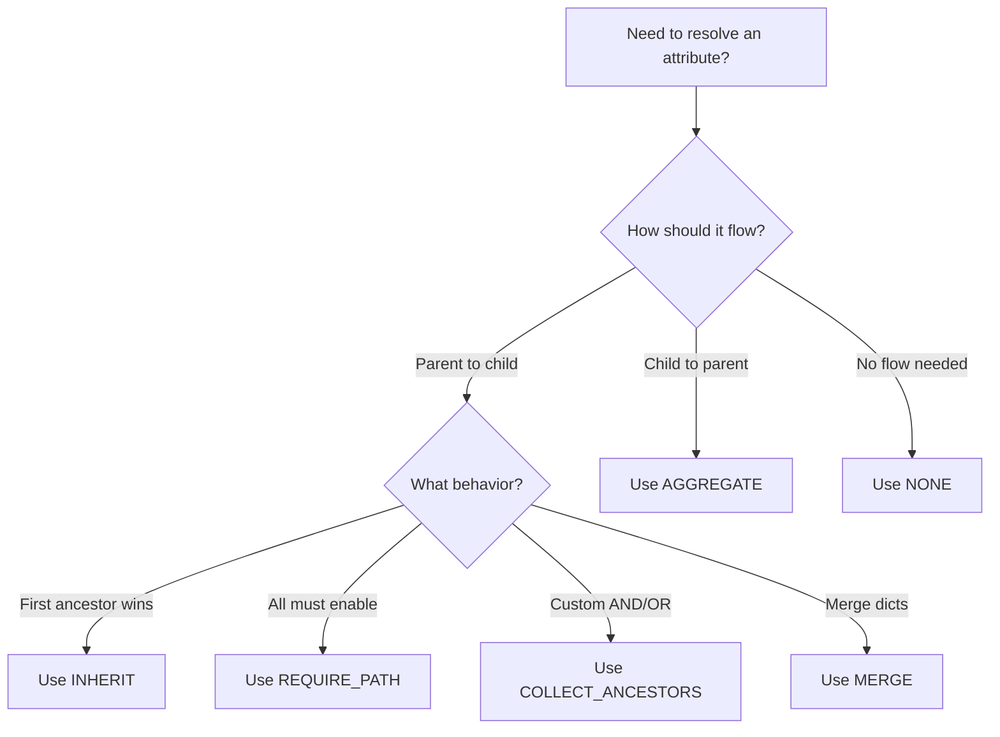

# Propagation Modes

Propagation modes control how attribute values flow through the resource tree. Choosing the right mode is key to effective hierarchical configuration.

## Overview

| Mode | Direction | Use Case |
|------|-----------|----------|
| `INHERIT` | Ancestors → Resource | Inherit defaults, allow overrides |
| `AGGREGATE` | Descendants → Resource | Aggregate values, collect metrics |
| `MERGE` | Ancestors → Resource | Deep-merge dictionaries |
| `REQUIRE_PATH` | Ancestors → Resource | All ancestors must have truthy values |
| `COLLECT_ANCESTORS` | Ancestors → Resource | Collect all ancestor values as a list |
| `NONE` | Local only | Get only directly set values |

## INHERIT - Inherit from Ancestors

Values cascade from parent to children. The **closest ancestor** with the attribute wins.

```python
from hrcp import ResourceTree, PropagationMode, get_value

tree = ResourceTree(root_name="org")
tree.root.set_attribute("timeout", 30)

tree.create("/org/team", attributes={"timeout": 60})
tree.create("/org/team/project")
tree.create("/org/team/project/service")

# Each resource inherits from closest ancestor with the value
root_timeout = get_value(tree.root, "timeout", PropagationMode.INHERIT)
# 30 - set locally

team_timeout = get_value(tree.get("/org/team"), "timeout", PropagationMode.INHERIT)
# 60 - set locally (overrides parent)

project_timeout = get_value(tree.get("/org/team/project"), "timeout", PropagationMode.INHERIT)
# 60 - inherited from /org/team

service_timeout = get_value(tree.get("/org/team/project/service"), "timeout", PropagationMode.INHERIT)
# 60 - inherited from /org/team (closest ancestor)
```

### When to Use INHERIT

- **Default configurations** that should apply to all children
- **Environment settings** (production, staging, development)
- **Policy values** that cascade through a hierarchy
- **Feature flags** that can be overridden at any level

## AGGREGATE - Aggregate from Descendants

Collect all values from the subtree beneath a resource.

```python
tree = ResourceTree(root_name="company")

tree.create("/company/eng", attributes={"headcount": 50})
tree.create("/company/eng/platform", attributes={"headcount": 15})
tree.create("/company/eng/mobile", attributes={"headcount": 10})
tree.create("/company/sales", attributes={"headcount": 30})

# Aggregate from all descendants
company = tree.root
headcounts = get_value(company, "headcount", PropagationMode.AGGREGATE)
# [50, 15, 10, 30] - all values from subtree

# Get from a subtree
eng = tree.get("/company/eng")
eng_headcounts = get_value(eng, "headcount", PropagationMode.AGGREGATE)
# [50, 15, 10] - only engineering subtree
```

!!! note "Result Type"
    AGGREGATE propagation always returns a **list** of all values found in the subtree, including the resource itself if it has the attribute.

### When to Use AGGREGATE

- **Rollup metrics** (headcount, budget, resource usage)
- **Collecting tags or labels** from children
- **Auditing** what values exist in a subtree
- **Validation** to ensure all children have required values

## MERGE - Deep Dictionary Merge

Recursively merge dictionaries from ancestors. Child values override parent values at each key level.

```python
tree = ResourceTree(root_name="platform")

tree.root.set_attribute("config", {
    "database": {
        "host": "localhost",
        "port": 5432,
        "pool_size": 10
    },
    "cache": {
        "enabled": True,
        "ttl": 300
    }
})

tree.create("/platform/prod", attributes={
    "config": {
        "database": {
            "host": "prod.db.internal",
            "pool_size": 50
        }
    }
})

prod = tree.get("/platform/prod")
config = get_value(prod, "config", PropagationMode.MERGE)
# {
#     "database": {
#         "host": "prod.db.internal",  # overridden
#         "port": 5432,                 # inherited
#         "pool_size": 50               # overridden
#     },
#     "cache": {
#         "enabled": True,              # inherited
#         "ttl": 300                    # inherited
#     }
# }
```

### Merge Rules

1. Child values override parent values for the same key
2. Merge happens recursively for nested dicts
3. Non-dict values are not merged (child wins completely)
4. New keys from child are added

### When to Use MERGE

- **Complex configuration objects** with many nested settings
- **Layered overrides** where children customize parts of a structure
- **Feature configurations** with many options

## REQUIRE_PATH - All Ancestors Must Enable

Returns the local value **only if ALL ancestors** (from self to root) have a truthy value for the attribute. If any ancestor is missing the attribute or has a falsy value, returns `None`.

This is ideal for **opt-in features** where every level must explicitly enable.

```python
tree = ResourceTree(root_name="platform")

# Platform enables the feature
tree.root.set_attribute("basket_enabled", True)

# Org enables it
tree.create("/platform/org", attributes={"basket_enabled": True})

# Account enables it
account = tree.create("/platform/org/account", attributes={"basket_enabled": True})

# All ancestors enabled → returns True
enabled = get_value(account, "basket_enabled", PropagationMode.REQUIRE_PATH)
# True

# Now try with org disabled
tree.get("/platform/org").set_attribute("basket_enabled", False)
enabled = get_value(account, "basket_enabled", PropagationMode.REQUIRE_PATH)
# None - org has falsy value, breaks the chain
```

### Use Case: Feature Flags with Opt-In

```python
# Basket feature: ALL levels must enable (opt-in)
def has_basket_feature(account):
    return bool(get_value(account, "basket_enabled", PropagationMode.REQUIRE_PATH))

# Platform: True, Org: True, Account: True → True
# Platform: True, Org: True, Account: False → False
# Platform: True, Org: False, Account: True → False
# Platform: False, Org: True, Account: True → False
```

### When to Use REQUIRE_PATH

- **Opt-in features** that require explicit enablement at every level
- **Compliance requirements** where all levels must approve
- **Cascading permissions** that can be revoked at any level

## COLLECT_ANCESTORS - Collect All Ancestor Values

Collects all values from the resource up to the root as a list. Returns values in order from the resource (first) to root (last).

This allows **custom AND/OR logic** for more complex inheritance patterns.

```python
tree = ResourceTree(root_name="platform")
tree.root.set_attribute("enabled", True)
tree.create("/platform/org", attributes={"enabled": True})
account = tree.create("/platform/org/account", attributes={"enabled": False})

# Collect all values from account to root
values = get_value(account, "enabled", PropagationMode.COLLECT_ANCESTORS)
# [False, True, True] - account, org, platform

# Custom logic
all(values)  # False - AND (like REQUIRE_PATH)
any(values)  # True - OR (at least one ancestor has it)
```

### Use Case: Feature Flags with Inheritance (STP-style)

```python
# STP feature: If platform/org enables, accounts inherit automatically
def has_stp_feature(account):
    values = get_value(account, "stp_enabled", PropagationMode.COLLECT_ANCESTORS)
    return any(values) if values else False

# Platform: True, Org: True, Account: None → True (inherited)
# Platform: True, Org: False, Account: None → True (from platform)
# Platform: False, Org: False, Account: False → False
```

### When to Use COLLECT_ANCESTORS

- **Custom inheritance logic** (AND, OR, majority vote, etc.)
- **Debugging** to see what values exist along the path
- **Complex feature flag patterns** that don't fit INHERIT or REQUIRE_PATH

## NONE - Local Only

Return only the value set directly on the resource. No inheritance, no aggregation.

```python
tree = ResourceTree(root_name="org")
tree.root.set_attribute("global_id", "ORG-001")

tree.create("/org/team")

team = tree.get("/org/team")

# NONE returns only local value
local = get_value(team, "global_id", PropagationMode.NONE)
# None - not set on this resource

# INHERIT would inherit
inherited = get_value(team, "global_id", PropagationMode.INHERIT)
# "ORG-001" - inherited from root
```

### When to Use NONE

- **Checking if a value is explicitly set** on a specific resource
- **Avoiding unintended inheritance** for resource-specific values
- **Validation** to ensure required values are set locally

## Choosing the Right Mode



| Scenario | Recommended Mode |
|----------|-----------------|
| Default timeout for all services | INHERIT |
| Environment name (prod/staging) | INHERIT |
| Opt-in feature (all levels must enable) | REQUIRE_PATH |
| Inherited feature (any ancestor enables) | INHERIT or COLLECT_ANCESTORS + `any()` |
| Team-specific budget | NONE or INHERIT |
| Total headcount across org | AGGREGATE |
| Layered feature flags | MERGE |
| Database connection config | MERGE |
| Resource-specific identifier | NONE |
| Custom permission logic | COLLECT_ANCESTORS |

## Backward Compatibility

The following aliases are available for backward compatibility but are deprecated:

| Deprecated | Use Instead |
|------------|-------------|
| `DOWN` | `INHERIT` |
| `UP` | `AGGREGATE` |
| `MERGE_DOWN` | `MERGE` |
